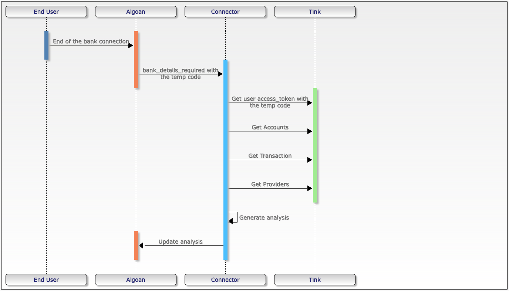

<p align="center">
  <a href="http://algoan.com/" target="blank"></a>
</p>


# Algoan NestJS Tink connector

A simple connector using [NestJS](https://nestjs.com/) framework to connect your service to [Tink](https://tink.com/).

## Description

[Nest](https://github.com/nestjs/nest) framework TypeScript starter repository for Algoan connectors.

## About Algoan and Tink

- [Algoan](https://www.algoan.com) helps companies to build the best open banking experience for credits. To see our products, please refer to our official website
- [Tink](https://tink.com) is a swedish banking data aggregator for financial services.

## Goal and philosophy

A connector is a web software able to connect a provider to Algoan's API. It subscribes to REST Hooks which lets Algoan notifying the connector when a specific event happens.

The **`nestjs-tink-connector`** focuses on a user bank accounts and transactions. The main goal of this connector is to be able to retrieve a user bank data when Algoan wishes to.

## Listened subscriptions

This section describes the process required for each subscription for an aggregator connector.

### Aggregator Link Required

The Tink user needs to be redirected to an external page.

* The client should have this configuration data in the service account:
```
  {
    "clientId": string;
    "clientSecret": string;
    "pricing": "STANDARD" | "PREMIUM";
    "market": string; // Example: "FR"
    "locale": string; // Example: "fr_FR"
  }
```

* And the event should contains the customerId:
```
  {
    customerId: string;
  }
```

The diagram below describes interactions:


Refers to the [`aggregator_link_required`](https://developers.algoan.com/public/docs/algoan_documentation/resthooks_and_events/event_list.html#aggregator_link_required) event.

### Bank Details Required

When the user has finished the aggregation process, the connector has to retrieve user's banks accounts and transactions.

* The event should contains those informations:
```
  {
    customerId: string;
    analysisId: string; // The ananlysis id to update with account and transaction data
    temporaryCode: string; // The authorization code returned by Tink, in the callback url param named `code`
  }
```

The diagram below describes interactions:



Refers to the [`bank_details_required`](https://developers.algoan.com/public/docs/algoan_documentation/resthooks_and_events/event_list.html#bank_details_required) event.

## Application Structure

- `config/`: stores all configurations for the application. It uses [node-config-ts](https://github.com/tusharmath/node-config-ts) to generate a type definition of the `default.json` file.
- `src/config/`: Simple NestJs module to inject configuration in services
- `src/algoan/`: Algoan module getting your service accounts. It uses the [@algoan/rest](https://github.com/algoan/rest-nodejs) library.
- `src/tink/`: Tink module to manage Tink API.
- `src/hooks/`: Entry point for your [RestHook](https://developers.algoan.com/public/docs/algoan_documentation/resthooks_and_events/resthooks.html) called by Algoan. It handles [events](https://developers.algoan.com/public/docs/algoan_documentation/resthooks_and_events/event_list.html) you've subscribed to.
- `test/`: contains e2e tests.

## Contributing

We would love to have your contribution, thank you for that! 🎉

If you want to add missing APIs, or correct an issue, you will have to follow this list of instructions.

### Instructions

- Set up your local environment by forking the repository.
- When you are about to commit, [commitlint](https://github.com/conventional-changelog/commitlint) is running to check if your commit message respects [conventional commit](https://www.conventionalcommits.org/en/v1.0.0/).
- Write tests, there is a high coverage on the repository. Simply run `npm run test:cov` to generate a `coverage/` directory.
- Respect [coding style](#code-style). Run `npm run lint` to check if there are errors.
- Open a Pull Request where you describe the feature/issue you are about to publish.

### Code Style

This project uses [ESLint](https://eslint.org/) to analyze the TypeScript code. Commit are linted too thanks to [commitlint](https://github.com/conventional-changelog/commitlint) and the [conventional commit format](https://conventionalcommits.org/).

## Usage

How to use locally the connector

### Requirements

This connector is a [Node.js](https://nodejs.org/en/) application. Before reading further, you need to [download and install Node.js](https://nodejs.org/en/download/).
### Installation

Clone the repository:

```bash
$ git clone https://github.com/algoan/nestjs-tink-connector.git --depth=1
```

Install all dependencies running:

```bash
$ npm install
```

### How to test locally

To test locally the Tink Link process, a simple `index.html` file is rendered. To use it:

Before testing
- The client config: `locale`, `market`, `pricing` should be updated in `service-accounts.config` in  `./json-server/default.json'.
- You can enable http log `config/default.json` with `enableHttpRequestLog`, `enableHttpResponseLog`, `enableHttpErrorLog`

Run Test
- Run `npm run start:dev`. It will render an index.html file. Algoan APIs are exposed and mocked by a [json-server](https://github.com/typicode/json-server).
- Go to your favorite browser and navigate to http://localhost:4000. It should display a web page:


- Click on the first button "Redirect to Tink Link". It will call a `GET /redirect` API which simulates a webhook call to your connector and tries to fetch a redirect URL.
- At the end of the Tink Link process, a `GET /callback?code=...` will be called. It will simulated the `bank_reader_details` webhook event to the connector.

## Test

```bash
# unit tests
$ npm run test

# e2e tests
$ npm run test:e2e

# test coverage
$ npm run test:cov
```

## Support

If you need credentials for your service, please contact support@algoan.com.
